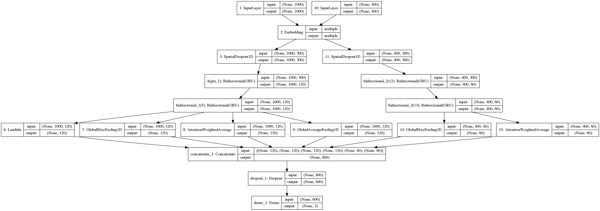
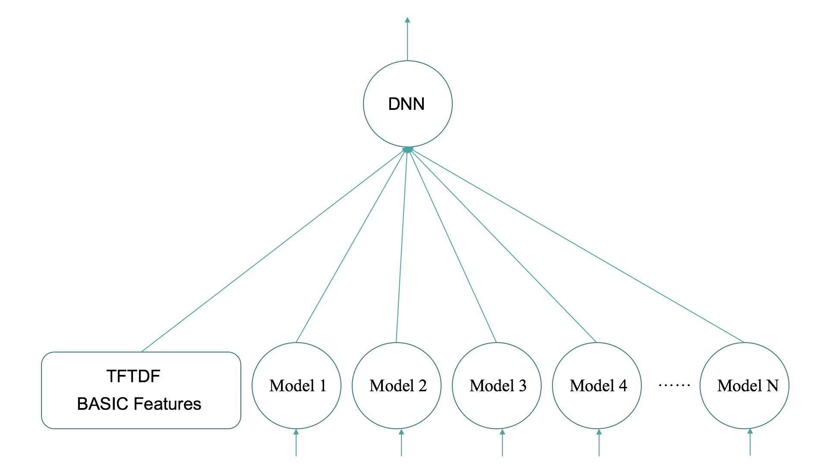

# 简介
第二届搜狐内容识别大赛冠军LuckyRabbit团队的解决方案，关于参赛细节和详解，请参阅[说明文档](https://blog.csdn.net/qq_34695147/article/details/80992515)
## 代码流程
整个代码分为数据预处理、特征提取、单模型、stacking模型融合、trick部分
    

## Input
输入数据是HTML格式的新闻和附带的图片

    <title>惠尔新品 | 冷色系实木多层地板系列</title> <p>  </p> <br/><p>  <span style="font-size: 16px;">冷色系实木多层系列全新上市</span></p>	P0000001.JPEG;P0000002.JPEG; 
## Preprocessing
* 文本翻译数据增强：把中文翻译成英文、再把英文翻译回中文，代码中没有给出，可自行调API接口
* 图片数据增强：图片旋转、平移、加噪声、过采样
* 使用[jieba分词](https://github.com/fxsjy/jieba)为基本分词组件
## Feature Extraction
* [gensim](https://github.com/RaRe-Technologies/gensim)训练好的300维词向量 [百度云盘](https://pan.baidu.com/s/11x9jhiof7Ik0rF-3zKL3eQ)
* TFIDF 特征 + SVD进行降维度
* 字向量特征 
* 基础特征：是否含有手机号、微信号等
* OCR文字提取
    提取图片上包含的文字来补充文本分类信息
    
## 单模型
这里拿一个经典的模型来做一个例子, 我们把ocr提取出来的文本和新闻文本分别输入到同一个embedding层，随后再连接做分类
    
各种模型的得分如下

| 模型或方法          | 得分F1-measure                                   |
| ----------- | ---------------------------------------- 
| catboost     | 0.611                                  |
| xgboost         | 0.621                                   |
| lightgbm      | 0.625                                   |
| dnn         | 0.621|
| textCNN  |0.617|
| capsule      |0.625|
| covlstm    |0.630|    
| dpcnn    |0.626|    
| lstm+gru    |0.635|    
| lstm+gru+attention    |0.640| 
(ps 由于大赛评分系统关闭了，个别模型得分可能不太准确)
## 模型融合
### Stacking
  关于stacking这里有一篇很好的模型融合方法的[介绍](https://mlwave.com/kaggle-ensembling-guide/)
  我们比赛中使用的stacking模型结构如下图所示
  
  
### Snapshot Emsemble
   在stacking第二层模型中我们还加入了深度融合的方法，[论文地址](https://arxiv.org/abs/1704.00109)
   
### Pesudo Labeling
   我们使用的另外一个trick就是pesudo-labeling 方法，它适用于所有给定测试集的比赛 [教程](https://shaoanlu.wordpress.com/2017/04/10/a-simple-pseudo-labeling-function-implementation-in-keras/)

方法效果如下

| 模型或方法          | 得分F1-measure                                   |
| ----------- | ---------------------------------------- 
| 单一模型     | 0.642                                  |
| stacking         | 0.647                                   |
| stacking+trick      | 0.652                                   |

# 代码结构
|- SOHU_competition<br/>
|　　|- data  　　　　　　　　　<br/>
|　　|　　|-result　           模型输出结果  <br/>
|　　|　　|- ···　　　　　　　　　　<br/>
|　　|- ckpt　　　　　　　　　　　# 保存模型<br/>
|　　|- img　　　　　　　# 说明图片<br/>
|　　|- src　　　　　　　　　　# 模型代码<br/>
|　　|　　|- model　　　　 # 模型<br/>
|　　|　　|　　|- model_basic　　　　# 定义模型训练方法等　　<br/>
|　　|　　|　　|- attention_model　　　　# 模型定义　　<br/>
|　　|　　|　　|- ···　　　<br/>
|　　|　　|- preprocess　<br/>
|　　|　　|　　|- EDA&Extract.ipynb　　# 特征处理和提取流程　<br/>
|　　|　　|　　|- ···　　　<br/>
|　　|　　|- ocr　<br/>
|　　|　　|- train&predict.ipynb # 单模型的训练和测试　<br/>
|　　|　　|- stacking.ipynb #  模型融合　<br/>


# 使用方式：
* ```git clone https://github.com/zhanzecheng/SOHU_competition.git```
* 下载新闻文本训练文件，放在 ```./data/```路径下，[地址](https://pan.baidu.com/s/12WZoc2SNOrwim6RpGw6KlQ)，图片文件过大，请自行去官网下载
* 下载ocr模型文件，放在 ```./src/ocr/ctpn/checkpoints/ ```路径下，[模型地址](https://pan.baidu.com/s/1L6wx32sJEX01BEHf-ha_pw)
* ```pip3 install -r requirement.txt```
* 下载词向量，放到 ```./data ```目录下
* 执行 ```EDA&Extract.ipynb```
* 执行 ```train&predict.ipynb```
* 执行 ```stacking.ipynb```


# 感谢

感谢两位帅气的队友[HiYellowC](https://github.com/HiYellowC)和[yupeihua](https://github.com/yupeihua)

这里还有我们的答辩[PPT](https://pan.baidu.com/s/1UF48Awpam_4gPAmyHcDYFQ)，如果需要的话自行下载
